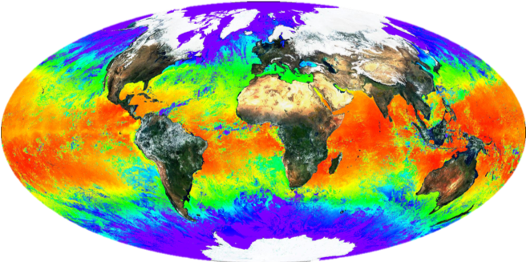

## Marine Heatwave

**Project Lead:** *Hillary Scannell, School of Oceanography*

  

  

### Abstract

Marine heatwaves are discrete and extreme warming events in the ocean surface that we can detect using satellite-derived observations of globally gridded (0.25ºx0.25º) daily sea surface temperatures since 1982. There are numerous studies of event-based research that depict a static image or composite of elevated temperatures during an event. The problem with this view is that is does not convey the growth, evolution, or decay of a marine heatwave over time. To address this problem, I propose a design study that will visualize 3-D marine heatwave anomaly isosurfaces in longitude, latitude, and time using Python and JavaScript as foundational coding tools. The design will be animated in time and have rotational functionality to counter possible occlusion. Using this visualization, we can explore some interesting hypotheses about marine heatwave patterns. In particular, do marine heatwaves develop instantaneously over a large area or do they slowly progress locally? It would be interesting to tease out these characteristics through this visualization design and pair it with what is known about the formation mechanisms from the event-based literature.

#### [Link to Poster](final/poster.pdf)
