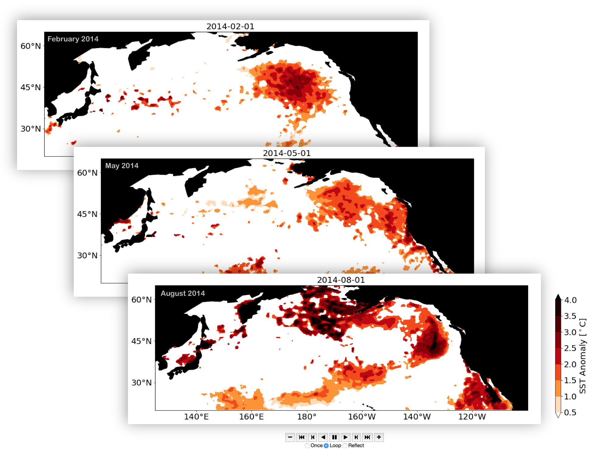

# Marine Heatwave
### Visualizing Ocean Temperature Extremes

Hillary Scannell, School of Oceanography, University of Washington

<p align="center">
  
</p>  

#### [Link to Animation](https://cse512-18s.github.io/marine-heatwave/images/mhw.html) (may take a few minutes to load)
#### [Link to Poster](final/poster.pdf)

### Abstract

Marine heatwaves are discrete and extreme warming events in the ocean surface that we can detect using satellite-derived observations of globally gridded (0.25ºx0.25º) daily sea surface temperatures since 1982. There are numerous studies of event-based research that depict a static image or composite of elevated temperatures during an event. The problem with this view is that is does not convey the growth, evolution, or decay of a marine heatwave over time. To address this problem, I propose a design study that will visualize 3-D marine heatwave anomaly isosurfaces in longitude, latitude, and time using Python and JavaScript as foundational coding tools. The design will be animated in time and have rotational functionality to counter possible occlusion. Using this visualization, we can explore some interesting hypotheses about marine heatwave patterns. In particular, do marine heatwaves develop instantaneously over a large area or do they slowly progress locally? It would be interesting to tease out these characteristics through this visualization design and pair it with what is known about the formation mechanisms from the event-based literature.


### Data Acquition

Daily global sea surface temperatures are available from the [Optimum Interpolation Sea Surface Temperature (OISST)](https://www.ncdc.noaa.gov/oisst) dataset maintained by the National Oceanic and Atmospheric Administration National Centers for Environmental Information. Data is gridded on a regular global grid with a 0.25º resolution and measured from satellite using Advanced Very High Radiometer, which are combined with ship and buoy observations. Spatial interpolation is used to fill data gaps and measurements are bias adjusted across different data collection platforms and sensor suites.


To download gridded netCDF AVHRR-Only data, run the following commands from your terminal. 

```sh
$ for i in {1981..2018}; do
$   echo ${i}
$   wget -r ftp://ftp.cdc.noaa.gov/Datasets/noaa.oisst.v2.highres/sst.day.mean.${i}.v2.nc
$ done
```

For time concatenation and domain selection over the North Pacific (20-65ºN, 125ºE-110ºW)...

```sh
$ ncrcat *.v2.nc OISSTv2.1981.2018.nc  
$ ncks -O --mk_rec_dmn time -v sst -d lon,125.0,255.0 -d lat,20.0,65.0 OISSTv2.1981.2018.nc OISSTv2.NP.1981.2018.nc 
```


### Visualization Implementation

This module contains two Jupyter Notebooks on the GitHub Repo.  Instructions on how to use them are outlined within the files below.

| Notebook | Link |
| ------ | ------ |
| MHWclassify | [marine-heatwave/data/MHWclassify.ipynb](https://github.com/cse512-18s/marine-heatwave/blob/master/data/MHWclassify.ipynb) |
| MHW_NP_animate | [marine-heatwave/data/MHW_NP_animate.ipynb](https://github.com/cse512-18s/marine-heatwave/blob/master/data/MHW_NP_animate.ipynb) |
