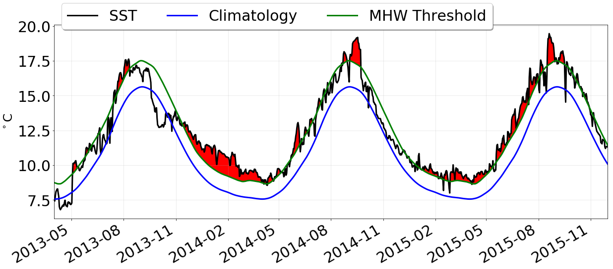

# Marine Heatwave 

### Visualizing Ocean Temperature Extremes

Hillary Scannell, School of Oceanography, University of Washington

<p align="center">
  
</p>  

### Abstract

Marine heatwaves are discrete and extreme warming events in the ocean surface that we can detect using satellite-derived observations of globally gridded daily sea surface temperatures (SSTs) since 1981. There are numerous studies of event-based research that depict a static image or composite of elevated temperatures during an event. The problem with this view is that it does not convey the growth, evolution, or decay of marine heatwaves over time. This motivates the development of marine heatwave visualizations to better understand their evolution and movement through animation. I approached this problem by (1) modifying a classification algorithm that extracts marine heatwave event information from daily SST observations, (2) computing summary metrics over the entire data record (1981-2018) and (3) creating an animation of marine heatwave SST anomalies during the northeast Pacific event. Marine heatwaves are mapped to a Plate Carrée projection centered in the North Pacific and are color encoded according to the intensity of SST anomalies [ºC] above the 1988-2017 climatology. Data frames are animated using Matplotlib and rendered as an interactive JavaScript widget. Using animation to track the Pacific marine heatwave in 2014 helps tell a story about this event. Anomalies >2ºC were confined offshore early in the year and spread to the U.S. West Coast by late spring where the intensity was less severe. Anomalies were likely brought to the coast by seasonal spring storms and cooled via coastal upwelling. By late summer, the pattern becomes canonical extending westward and reaching further north and south with the most extreme temperatures occurring near the Bering Sea and surrounding Baja California. 

#### [Link to Animation](images/mhw.html) (may take a few minutes to load)
#### [Link to Poster](final/poster.pdf)
#### [Link to Paper](https://cse512-18s.github.io/marine-heatwave/final/paper.pdf)
* * *
### What is a Marine Heatwave?

Marine heatwaves are extreme and often prolonged warming events in sea surface temperature (SST) that have been observed around the world. A well-known event occurred in the northeast Pacific in late 2013 and persisted through 2015. This Pacific marine heatwave (MHW) had devasting impacts on coastal ecosystems, fisheries and the economy. 
<p align="center">
  
</p>
To study the impacts of these extreme events, marine heatwaves are defined relative to their temperature intensity using a 90th percentile threshold calculated over on a 30-year climatology (1988-2017). An event is considered a marine heatwave when at least 5 continuous days are above this threshold with no more than a 2-day gap in between. <br> 

**Reference**: Hobday, A. J., L. V. Alexander, S. E. Perkins, D. A. Smale, S. C. Straub, J. Benthuysen, M. T. Burrows, M. G. Donat, M. Feng, N. J. Holbrook, P. J. Moore, E. C. J. Oliver, H. A. Scannell, A. Sen Gupta and T. Wernberg (2016), A hierarchical approach to defining marine heatwaves, _Prog. Oceanogr._, **141**: 227-238, [doi:10.1016/j.pocean.2015.12.014](https://www.sciencedirect.com/science/article/pii/S0079661116000057)

* * *
### Data Acquition

Global daily sea surface temperatures are available from the [Optimum Interpolation Sea Surface Temperature (OISST)](https://www.ncdc.noaa.gov/oisst) dataset maintained by the National Oceanic and Atmospheric Administration National Centers for Environmental Information. Data is gridded on a regular global grid with a 0.25º resolution and measured from satellite using Advanced Very High Radiometer, which are then combined with ship and buoy observations. Data is spatially interpolated to fill gaps and bias adjusted to account for differences in collection platforms and sensor suites.


To download gridded netCDF AVHRR-only data, run the following commands from your terminal. 

```sh
$ for i in {1981..2018}; do
$   echo ${i}
$   wget -r ftp://ftp.cdc.noaa.gov/Datasets/noaa.oisst.v2.highres/sst.day.mean.${i}.v2.nc
$ done
```

For time concatenation and domain selection over the North Pacific (20-65ºN, 125ºE-110ºW)...

```sh
$ ncrcat *.v2.nc OISSTv2.1981.2018.nc  
$ ncks -O --mk_rec_dmn time -v sst -d lon,125.0,255.0 -d lat,20.0,65.0 OISSTv2.1981.2018.nc OISSTv2.NP.1981.2018.nc 
```
* * *

### Visualization Implementation

This module contains two Jupyter Notebooks on the GitHub Repo.  Instructions on how to use them are outlined within the files below.

| Notebook | Link |
| ------ | ------ |
| MHWclassify | [marine-heatwave/data/MHWclassify.ipynb](https://github.com/cse512-18s/marine-heatwave/blob/master/data/MHWclassify.ipynb) |
| MHW_NP_animate | [marine-heatwave/data/MHW_NP_animate.ipynb](https://github.com/cse512-18s/marine-heatwave/blob/master/data/MHW_NP_animate.ipynb) |

* * *

<p align="right">
  
</p> 
